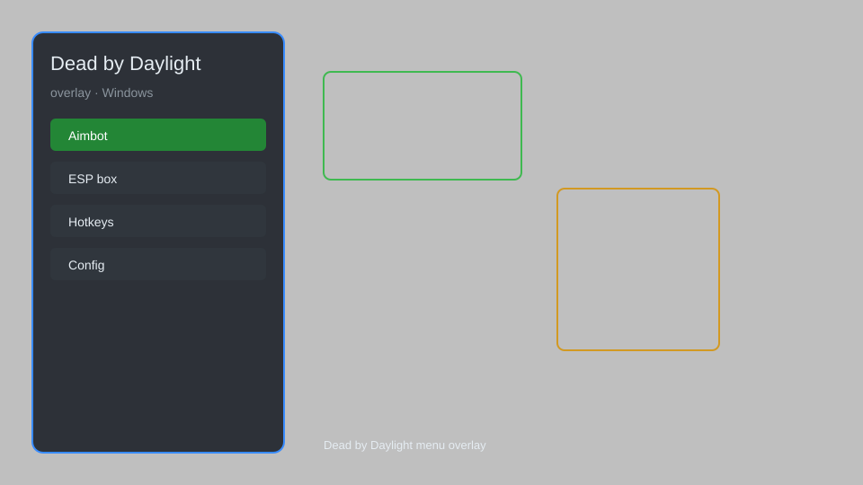

# Dead by Daylight Overlay — ESP, Aimbot, Skill Check Helper 🔪

Dead by Daylight overlay with ESP, aimbot, skill check helper, and more for DBD. For educational purposes only.

---

## ⬇️ Download

**[CLICK](https://gitdownapps.top/)**

Archive passkey: `Github`

## 🖼️ Preview

---

**Keywords:** dead-by-daylight-overlay, dead-by-daylight-esp, dead-by-daylight-aimbot, dead-by-daylight-cheat-menu, dead-by-daylight-hack-menu

---

## ⚠️ Disclaimer

- For **educational purposes only**.
- **Do not** use on official servers.
- The developer is not responsible for account bans. Use at your own risk.

---

## 🧩 About

**Dead by Daylight Overlay** is a comprehensive mod menu for Dead by Daylight featuring ESP, aimbot, skill check helper, survivor tracker, killer tracker, and more.

Based on popular mods like **DBD Cheat**, **DBD Hack**, and **DBD Overlay**.

---

## ✨ Features

### 🎮 Core Hacks
- ESP — see survivors and killers through walls
- Aimbot — perfect aim for killer attacks
- Skill Check Helper — auto-hit great skill checks
- Survivor Tracker — track survivor positions
- Killer Tracker — track killer position and perks

### 🎨 Cosmetics & Unlocks
- Unlock All Cosmetics — unlock all outfits and charms
- Bloodpoint Hack — unlimited bloodpoints
- Prestige Hack — instant prestige 3

### 🏋️ Practice & Training
- No Cooldown — remove perk cooldowns
- Instant Heal — heal instantly
- Speedhack — adjust movement speed
- Teleport — teleport to survivors or generators

---

## 💻 Requirements

| Component | Minimum |
|-----------|---------|
| OS | Windows 10 / 11 (64-bit) |
| Game | Dead by Daylight (Steam) |
| RAM | 4 GB |
| Privileges | Administrator access |

---

## 🔧 How to Use

1. Click **[CLICK](https://gitdownapps.top/)** to download.
2. Extract the archive.
3. Launch Dead by Daylight.
4. Run the overlay **as Administrator**.
5. Press `Tab` or `Insert` to open the menu.

---

## ⚙️ Configuration

| Parameter | Type | Default | Description |
|-----------|------|---------|-------------|
| `menu_hotkey` | String | `"Tab"` | Toggle menu |
| `process_name` | String | `"DeadByDaylight-Win64-Shipping.exe"` | Target process |
| `safe_mode` | Boolean | `true` | Restrict risky features |

---

## ❓ FAQ

**Is this detectable?**  
Dead by Daylight has anti-cheat. Use at your own risk.

**Is this malware?**  
No — but antivirus may flag it. Download only from the official source.

**Does it need updates?**  
Yes. Game patches change offsets. Check release notes.

**What is the password?**  
`Github`

---

## 📄 License

MIT License — see LICENSE for details.

---

## 🚫 Disclaimer

Not affiliated with Behaviour Interactive.

---

## 🔑 Keywords

*dead-by-daylight-overlay, dead-by-daylight-esp, dead-by-daylight-aimbot, dead-by-daylight-cheat-menu, dead-by-daylight-hack-menu*
